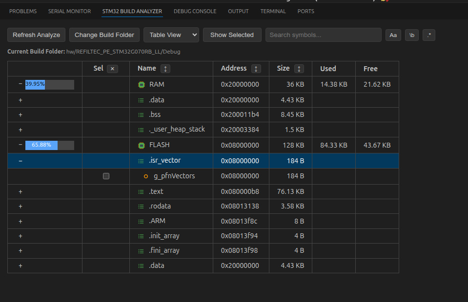

# STM32 Build Analyzer (Enhanced) 🚀  
[](LICENSE)
[](#)

> Visual memory analyzer for STM32 projects – works with `.map` and `.elf` files, no matter what toolchain or build system you use.



---

## ❓ Why This Fork?

The original version was depandet with cmake-tool extension.  
This fork removes that dependency, adds broader file handling, and enhances the UI for developers using VSCode, CMake, Makefiles, or any other custom setups.

---

## 🚀 Key Improvements in This Fork

✅ **Removed CMake dependency** – Works with any build system (Makefile, CubeIDE, etc.)  
✅ **Custom build folder support** – Easily set via UI button or command  
✅ **Improved file discovery** – More robust handling of `.map` and `.elf` files  
✅ **Optimized UI** – Visual memory usage indicators and new interactive controls  

---

## 🔍 Features

- Memory region analysis using `.map` and `.elf` files
- Detailed breakdown of memory sections and symbols
- Clickable links from symbols to source files
- Visual panel with color-coded usage (RAM, Flash)
- ARM toolchain integration (`arm-none-eabi-objdump`, `nm`)
- Compatible with any STM32 build system

---

## 📦 Installation

### From VS Code Marketplace (Coming soon)

📥 [Marketplace link placeholder](https://marketplace.visualstudio.com/items?itemName=niwciu.stm32-build-analyzer-enhanced#)

### Manual Installation

#### Requirements

1. Node.js installed  
2. npm installed  
3. `vsce` installed:
   ```bash
   npm install -g @vscode/vsce
   ```

#### Build and Install manual
1. Clone the repository:
   ```bash
   git clone https://github.com/niwciu/stm32-build-analyzer.git
   cd stm32-build-analyzer
   ```
2. Install dependencies:
   ```bash
   npm install
   ```
3. Build the .vsix package using vsce:
   ```bash
   vsce package
   ```
4. This will generate a file like: `stm32-build-analyzer-enhanced-1.1.2.vsix`

5. Install the extension in VS Code: 
   ```bash
   code --install-extension stm32-build-analyzer-enhanced-1.1.2.vsix
   ```


---

## 🛠 Usage

- Open the Command Palette (`Ctrl+Shift+P`) and run:
  - `STM32 Build Analyzer` – opens the main view
  - `STM32 Build Analyzer Refresh Paths` – re-detects build output folder
- Analyzer view updates automatically when build output files change.
- Use the **Sort** dropdown in the panel to order regions/sections/symbols by size.

---

## ⚙️ Configuration

The extension auto-detects `.map` + `.elf` files in common build folders. If your build outputs use different names or the ELF has no extension, configure a manual pair so the analyzer can still select the correct files.

### Manual map/elf pairs

Add one or more entries in **Settings → STM32 Build Analyzer (Enhanced) → Manual Build Pairs**:

```json
"stm32BuildAnalyzerEnhanced.manualBuildPairs": [
  {
    "label": "Release build",
    "folder": "build/Release",
    "map": "firmware.map",
    "elf": "firmware.out"
  }
]
```

Paths can be absolute or relative. `map` and `elf` paths may be relative to the `folder` when provided.

---

## 📜 Changelog

See [CHANGELOG.md](CHANGELOG.md) for full version history.

---

## 🤝 Contributing
 
Contributions are welcome! Please fork the repo and submit a pull request:

1. Fork the repository
2. Create your feature branch (`git checkout -b feature-name`)
3. Commit your changes (`git commit -m "Add feature"`)
4. Push to branch (`git push origin feature-name`)
5. Open a Pull Request

If you find bugs or want to request features, feel free to [open an issue](https://github.com/niwciu/stm32-build-analyzer/issues).


---

## ⚖️ License & Attribution

This extension is licensed under the [MIT License](LICENSE).  
Originally created by Aleksei Perevozchikov ([ATwice291](https://github.com/ATwice291))  
Fork maintained by [niwciu](https://github.com/niwciu) with enhancements described above.

---

<!-- SEO note -->
STM32 build analyzer for memory usage, symbol tracking, and map/elf inspection – compatible with Makefiles, CubeIDE, and other toolchains.

## ❤️ Thank you for using this version of STM32 Build Analyzer!

</br></br>
<div align="center">

***


***
</div>
